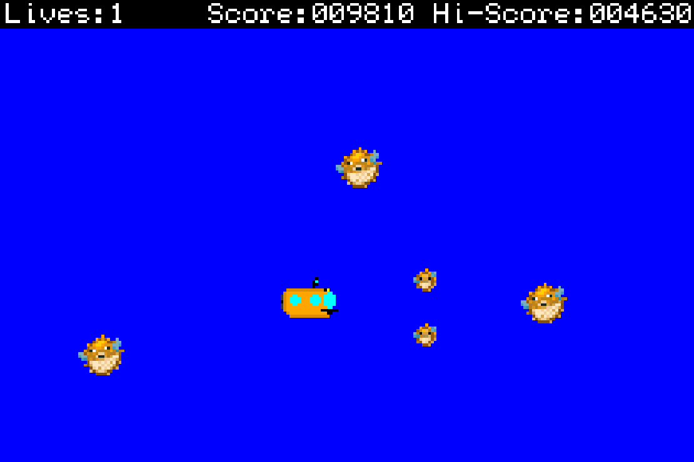

# MARINE BIOLOGIST SIMULATOR
*(aka homework 3)*
___

>You are a marine biologist in their natural habitat of a submarine under the
ocean, doing normal marine biologist things like performing unnatural
experiments on sea life. You latest creation, the giant pufferfish, has been
a dramatic success - such a success, in fact, that all of your test subjects
broke out of the lab and are seeking revenge. Thankfully, your standard issue
marine biologist submarine comes fully equipped with a certified marine
biology torpedo arsenal that you can use to protect yourself against your
bloodthirsty creations. Do whatever it takes to survive, and if you can't,
take out as many pufferfish as you can with you!

### RULES
The objective of the game is to earn as many points as possible, by surviving
for a long time and taking down as many pufferfish as possible. You do not 'win'
the game, you compete to get the highest score you can!
1. You have *3* lives! Getting hit by a pufferfish remove a life. If your lives
hit 0, it's game over!
2. Your submarine will quickly flash briefly after being hit. You are invincible
during this time!
3. Shoot torpedoes at pufferfish to defeat them. Two smaller pufferfish will
pop out of the bigger ones!
4. You gain 10 points for every second you survive, 500 points for defeating
a pufferfish, and 1000 points for defeating one if its evasive spawn.
5. Your lives, score, and high-score are displayed at the top of the screen.

### CONTROLS
- **Directional-pad** - Move your submarine
- **B button** - Fire a torpedo
- **Select button** - Pause game

### WALKTHROUGH
You start the game on the start screen. Press *select* to start the game proper.
While in the game state, press *select* again to pause the game. *Select* can
once again be used to un-pause the game from the pause screen, or you can press
*start* to return to the start screen. Don't worry, it will save your high
score! If you run out of live, you will see the lose screen, on which you can
press the *select* button to play again or the *start* button to return to the
start screen.

### KNOWN ISSUES
When pufferfish overlap, they overwrite their friend with some background blue.
To be fair, I don't think there's a good way to do transparency in mode 3
without an incredible amount of lag anyway (at least in my attempts).

### STUFF USED
- [nin10kit](https://github.com/TricksterGuy/nin10kit)
- [HTML to 15-bit color converter](http://www.budmelvin.com/dev/15bitconverter.html)
- Pufferfish image from Minecraft
