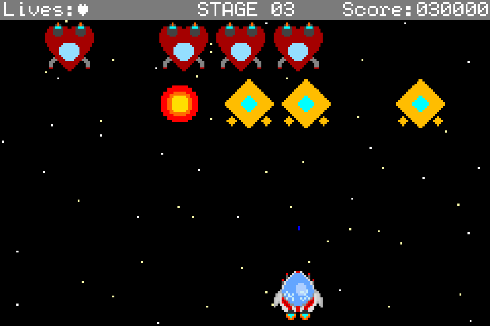

# GALACTIC DEFENDER
*(aka homework 4)*
___

>You are a Galactic Defender, protector of mankind and slayer of evil aliens. 
The alien fleet is currently on its way to invade Earth and there are far too
many of them for Earth to take on alone! The alien hordes are endless, but it
is up to you to take down as many as possible before they reach Earth.

### RULES
Your objective as a Galactic Defender is to whittle down the alien hordes before
they reach Earth. Earn points by eliminating as many aliens as possible and
bonus points for each full wave you clear. But be careful! Your spaceship can
only take on so many hits before it falls apart!
1. You have *3* lives! Getting shot costs one life, and if you run out, its game
over! The amount of lives you have is indicated at the top left of the screen as
well as by the lights on your ship. You don't get your lives back after losing them
so fly carefully!
2. Your ship is briefly invulnerable after being hit. This is indicated by the
ship flashing rapidly.
3. Shoot the aliens to make them explode! Explode a full screen of aliens to move
on to the next stage!
4. You gain 100 points for defeating a green alien, 250, for a yellow alien, 500
for a red alien, and 10000(!) points for clearing each stage!
5. Your lives, current stage, and score are displayed at the top of the screen.

### CONTROLS
- **Directional-pad** - Move your spaceship left and right
- **B button** - Fire a bullet
- **Select button** - Pause game

### WALKTHROUGH
You start the game on the start screen. Press *select* to enter into the game.
Every time you enter a new stage, you will be given a brief moment to prepare youself
before the action begins. While in the game state, press *select* again to pause 
the game. Pressing *select* again will resume the game, or you can press *start*
to return to the start screen. When you successfully clear a wave of aliens, your 
ship will move up to the next group of aliens. If the aliens destroy your ship, they
will move onwards to Earth, leaving you behind. After this you will see the lose 
screen, which displays your score, whether it was your high score, and prompts you
to either press the *select* button to play again or the *start* button to return 
to the start screen.

### KNOWN ISSUES
If an explosion occurs while another explosion sound is playing, the new explosion will
stop the old sound and start a new one.

### STUFF USED
- Usenti
